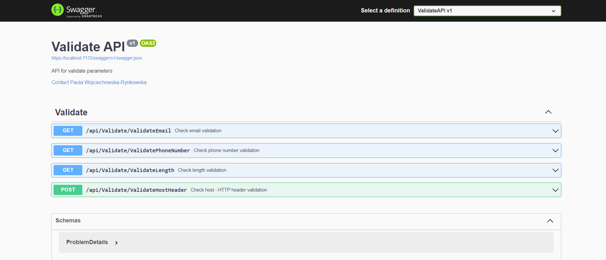
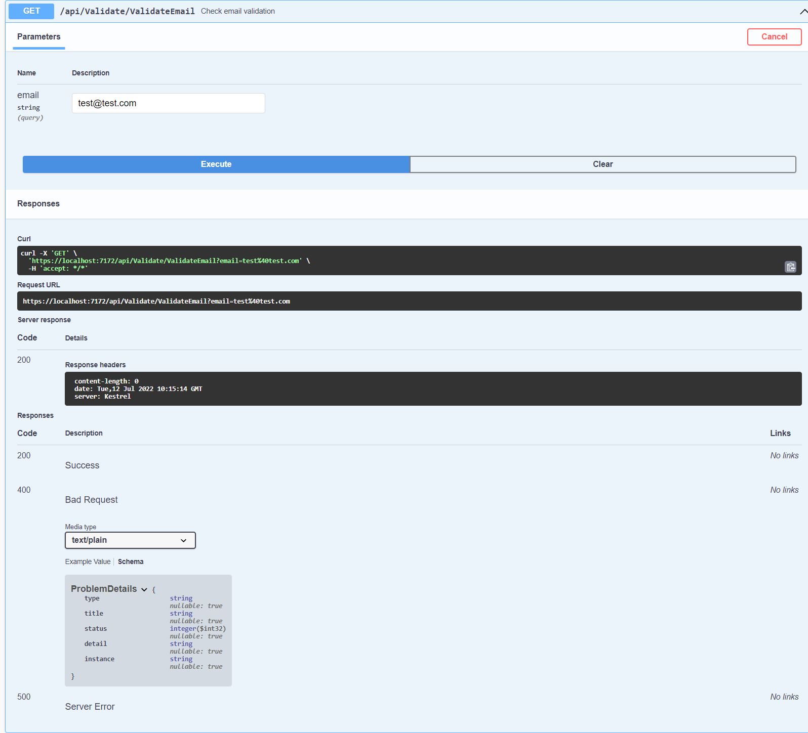
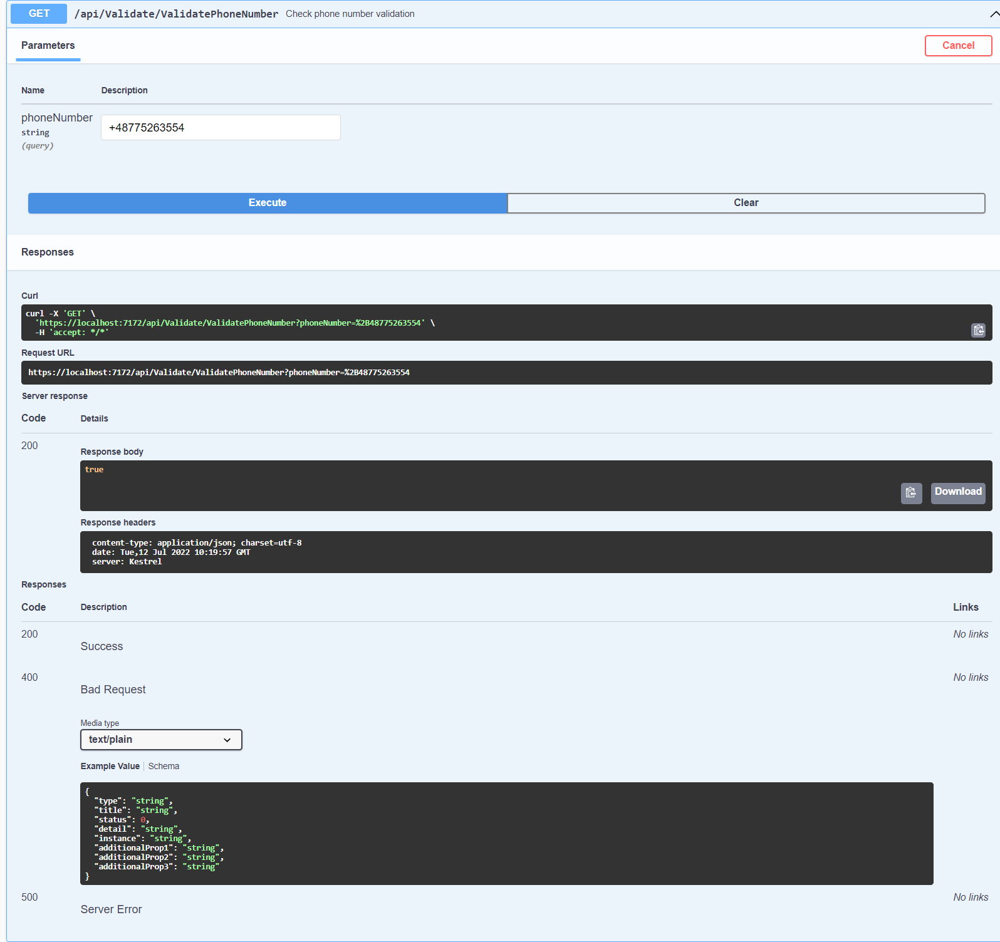
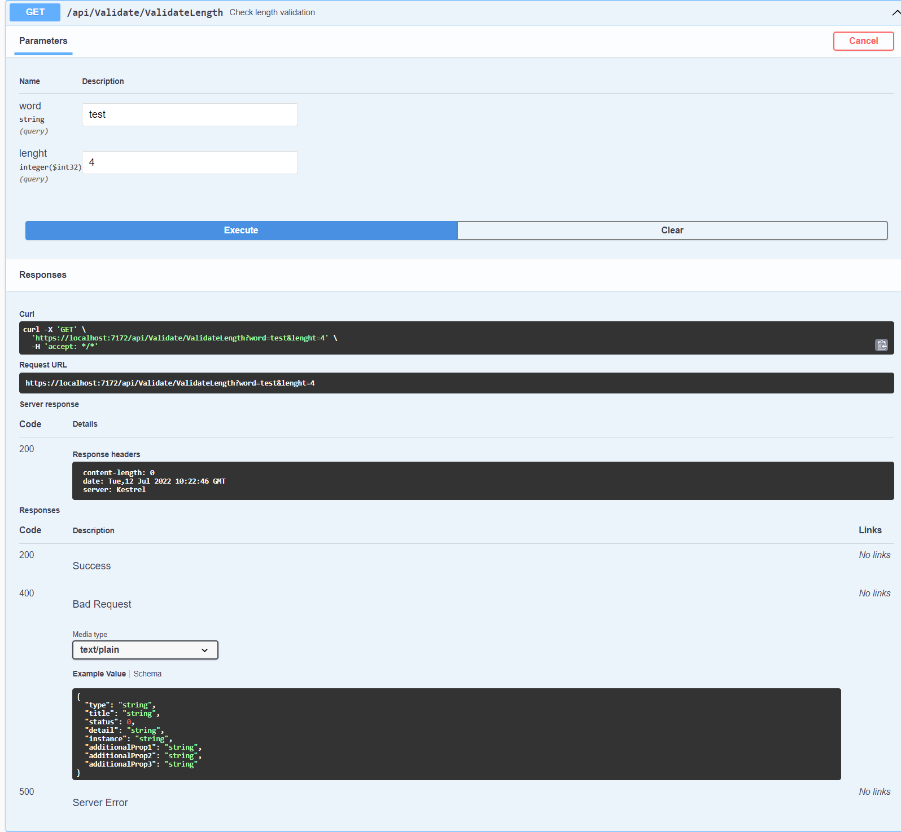
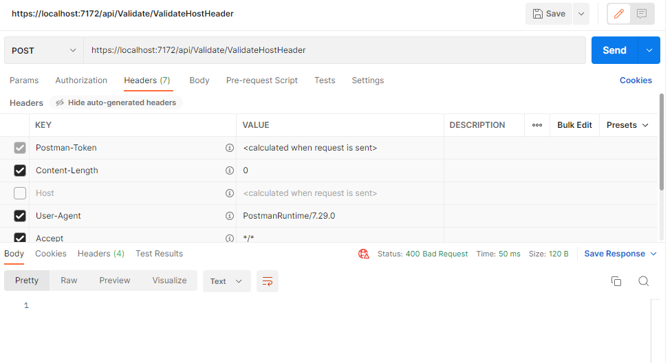

# ValidateAPI

Simple API for validate data.

## Description

API validates parametres like email, phone number, length of string and HTTP host header.
Project methods contains unit tests.
Full documentation in Swagger, includes descriptions of methods, parameters and possible results.
To show the result of the host header validation, I used the Postman tool.

## Build with
- .NET 6.0
- Swashbuckle
- xUnit

